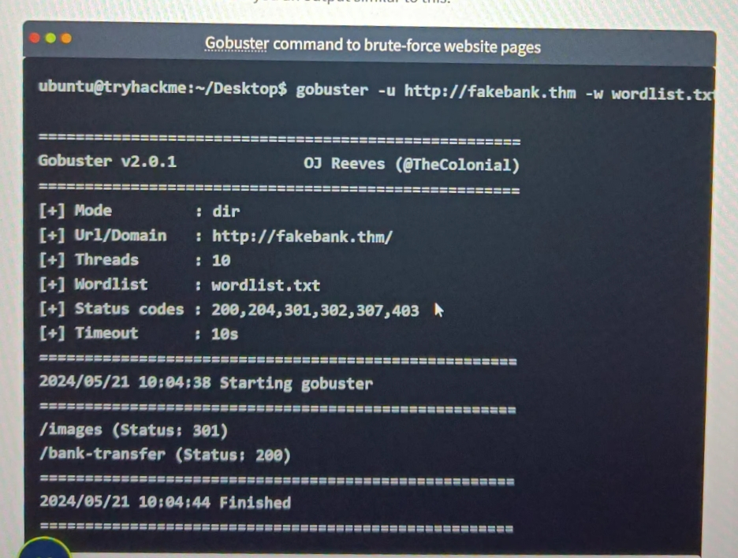

### 1. Use Gobuster
 
Gobuster ব্যবহার করে কোন  Website (ex: fakebank.thm) কে brute-force করে এর hidden dictionaries and pages খুজে বের করা যায় ।

 
step-1: open terminal on linax 
 
step-2: type --------> gubster -u https://fakebank.thm -w  wordlist.txt dir
 
 

 
step-3: এখন browser's address bar এ <b>/bank-transfer<b> লেখে  enter করলে টাকা ট্রান্সফার এর জায়গা পেয়ে যাবো। এভাবে হ্যাকাররা টাকা চুরি করে।

### 2.
 

#### -------Windows option--------
 
-->Windows PowerShell ISE
 
Commands: -
 
systeminfo 
net user  
net user benoy / net user name 
net user administrator 
net localgroup administrators 
 
-->Task Scheduler
 
--> Event View 
--> Windows Firewall with Advanced Security on Local Computer
 
 

নেট Command এর জন্য ওয়েবসাইট----
 
Link: https://learn.microsoft.com/en-us/troubleshoot/windows-server/networking/net-commands-on-operating-systems
 
Link: https://www.lifewire.com/net-command-2618094

